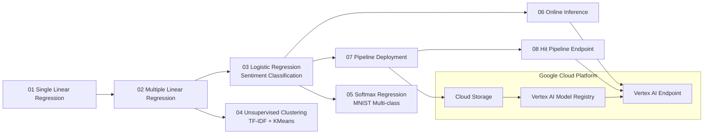

# AI/ML Learning Journey: From Regression to Vertex AI Deployment

<p align="left">
	
	
	
	
	
	
</p>

## Project Overview

This repository is a practical AI/ML learning roadmap that starts with foundational regression models and advances to real-world cloud deployment on Google Cloud Vertex AI.

It covers:

- Supervised learning (regression, binary classification, multi-class classification)
- Unsupervised learning (document clustering)
- NLP feature engineering (Bag of Words, TF-IDF, lemmatization)
- Model artifact management (`.joblib`) and cloud inference workflows
- End-to-end deployment and endpoint testing on GCP

## Table of Contents

- [Project Architecture and Roadmap](#project-architecture-and-roadmap)
- [Tech Stack](#tech-stack)
- [Full Project Structure](#full-project-structure)
- [Module Guide (01-08)](#module-guide-01-08)
- [Getting Started](#getting-started)
- [Deployment Notes](#deployment-notes)

## Project Architecture and Roadmap



## Tech Stack

| Area                       | Tools                                  |
| -------------------------- | -------------------------------------- |
| Language                   | Python                                 |
| Data                       | pandas, numpy                          |
| Visualization              | matplotlib, seaborn                    |
| ML                         | scikit-learn                           |
| NLP                        | CountVectorizer, TfidfVectorizer, NLTK |
| Cloud                      | Google Cloud Storage, Vertex AI        |
| Serialization              | joblib                                 |
| Notebook Runtime           | Jupyter                                |
| API Consumer (Client-side) | Laravel-ready HTTP integration         |

## Full Project Structure

```text
AI_Machine_Learning/
├── README.md
├── requirements.txt
├── advertising.csv
├── womens_clothing_ecommerce_reviews.csv
├── 01_Single_Linear_Regression/
│   ├── Linear_Regression.ipynb
│   └── README.md
├── 02_Multiple_Linear_Regression/
│   ├── Multiple_Linear_Regression.ipynb
│   └── README.md
├── 03_Linear_Classificaton ( Logistic Regression Model )/
│   ├── Linear_Classificaton - Logistic Regression Model .ipynb
│   └── README.md
├── 04_Unsupervised_Learnining_Clustering/
│   ├── 04_Unsupervised_Learnining_Clustering.ipynb
│   └── README.md
├── 05_Softmax_Regression/
│   ├── Softmax_Regression.ipynb
│   ├── README.md
│   ├── README_EN.md
│   └── README_SIN.md
├── 06_Get_Online_Inference/
│   ├── 06_Get_Online_Inference.ipynb
│   ├── 06_Get_Online_Inference.example.ipynb
│   ├── config.py
│   ├── model.joblib
│   ├── vectorizer.joblib
│   ├── request.json
│   ├── README.md
│   └── Readme/
├── 07_Pipeline_Deployment/
│   ├── Deploy_Pipeline_to_Vertex_AI.ipynb
│   ├── Deploy_Pipeline_to_Vertex_AI.example.ipynb
│   ├── Linear_Classificaton - Logistic Regression Model .ipynb
│   ├── config.py
│   ├── model.joblib
│   ├── vectorizer.joblib
│   └── README.md
└── 08_Hit_Pipeline_Deployment/
		├── 08_Pipeline_Deployment.example.ipynb
		├── config.py
		└── README.md
```

## Module Guide (01-08)

| Module | Focus                      | Outcome                                                |
| ------ | -------------------------- | ------------------------------------------------------ |
| 01     | Single Linear Regression   | Predict sales from TV advertising spend                |
| 02     | Multiple Linear Regression | Predict sales using TV + Radio + Newspaper             |
| 03     | Logistic Regression (NLP)  | Binary sentiment classification from review text       |
| 04     | K-Means Clustering (NLP)   | Cluster Wikipedia articles by topic                    |
| 05     | Softmax Regression         | Multi-class digit classification on MNIST              |
| 06     | Online Inference           | Call deployed Vertex AI endpoint using saved artifacts |
| 07     | Pipeline Deployment        | Upload/register/deploy model pipeline to Vertex AI     |
| 08     | Endpoint Hit Testing       | Send prediction requests to deployed endpoint          |

## Getting Started

### 1. Clone and enter project

```bash
git clone <your-repository-url>
cd AI_Machine_Learning
```

### 2. Create environment and install dependencies

```bash
python -m venv .venv
# Windows
.venv\Scripts\activate
# macOS/Linux
# source .venv/bin/activate

pip install -r requirements.txt
```

### 3. Run notebooks

```bash
jupyter notebook
```

Recommended execution order:

1. `01` -> `02` -> `03` -> `04` -> `05`
2. `06` -> `07` -> `08` (for cloud deployment/inference path)

### 4. GCP setup (for modules 06-08)

```bash
gcloud auth login
gcloud config set project YOUR_PROJECT_ID
```

Then copy `.env.example` to `.env` inside each deployment-related module and fill required variables.

## Deployment Notes

- Module `06` focuses on online predictions from an existing endpoint.
- Module `07` focuses on model registration and endpoint deployment in Vertex AI.
- Module `08` focuses on endpoint hit/testing and inference validation.

## Professional Highlights

- Built both classical ML and NLP pipelines in scikit-learn
- Used proper train/test strategies (including stratification where applicable)
- Tracked metrics by problem type (regression, classification, clustering)
- Transitioned from notebook experiments to deployable cloud inference
- Structured configuration with `.env` + `config.py` for reproducible deployments

---

If you are reviewing this repository for hiring, start with `03`, `05`, and `07` to see core modeling + deployment depth quickly.
